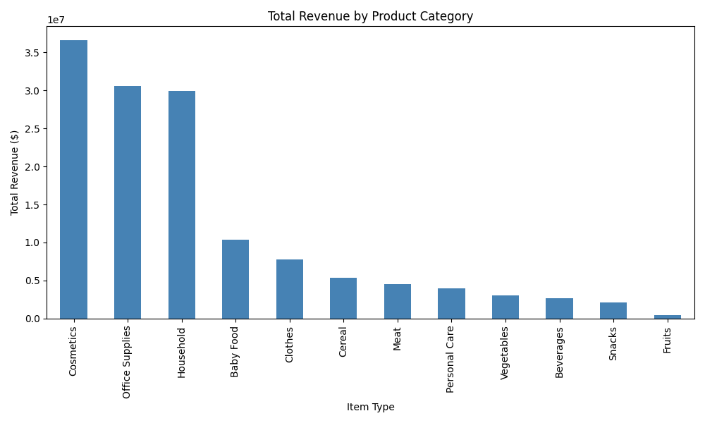

# Overview

As a software developer, I wanted to build practical experience analyzing real-world data with Python so that I can make data-driven decisions in future projects. This project applies the Pandas library to explore a sales dataset and answer specific business questions about it.

The dataset used is the ["100 Sales Records" sample dataset](https://gist.github.com/denandreychuk/b9aa812f10e4b60368cff69c6384a210), which contains 100 sales transactions with fields such as region, country, product category (Item Type), order date, units sold, and total revenue.

My purpose in writing this software was to practice loading, cleaning, and analyzing tabular data with Pandas, and to visualize the results with Matplotlib.

[Software Demo Video](https://youtu.be/nB2mPmC1YKg)

# Data Analysis Results

**Question 1: Which product category has the highest total sales?**
Answer: Cosmetics has the highest total sales, with $36,601,509.60 in revenue, followed by Office Supplies ($30,585,380.07) and Household ($29,889,712.29). I found this by grouping all transactions by `Item Type` and summing the `Total Revenue` column for each group.

**Question 2: Which day of the week has the highest number of sales transactions?**
Answer: Friday has the most orders, with 19 transactions, followed closely by Tuesday (18) and Saturday (17). I found this by converting the `Order Date` text column into an actual date, extracting the day of the week from it, and counting how many orders fell on each day.

# Development Environment

I used Visual Studio Code as my code editor and Git for version control, with the code hosted on GitHub.

I wrote the program in Python, using the Pandas library for data analysis (grouping, sorting, and aggregating) and the Matplotlib library to create a bar chart comparing total revenue across product categories.

# Useful Websites

* [Pandas Documentation](https://pandas.pydata.org/docs/)
* [Matplotlib Documentation](https://matplotlib.org/stable/index.html)
* [100 Sales Records Dataset](https://gist.github.com/denandreychuk/b9aa812f10e4b60368cff69c6384a210)

# Future Work

* Add a third question analyzing sales by region
* Compare online vs. offline sales channels
* Handle larger datasets and improve performance
